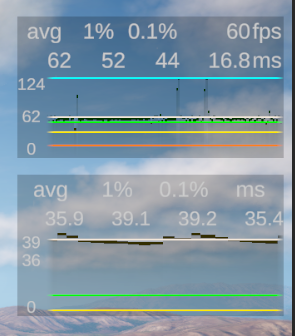

Simple version of [graphy](https://github.com/Tayx94/graphy)

Main differences:
- 5 levels instead fo 3 (Excellent, Good, Normal, Caution, Critical)
- Uses Textmeshpro
- char arrays to get non-alloc strings instead of lookup tables
- Simple interfaces to create new graphs, just implement `GraphDataSource` and `GraphText`



## Install

### Package manager

add to `manifest.json`
```
"com.james-frowen.graphy": "https://github.com/James-Frowen/graphy.git?path=/Assets/Graphy#v1.0.0",
```

note `#v1.0.0` can be changed with branch or commit hash

### Manual

- Copy files from `Assets/Graphy`
- Make sure you have Textmeshpro package

